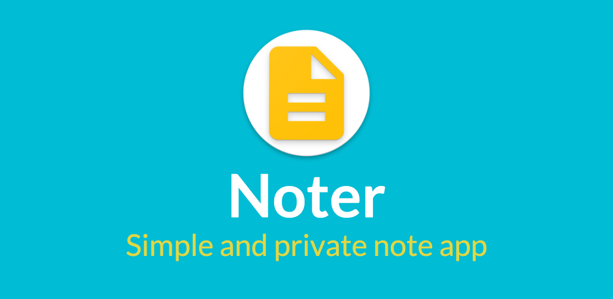
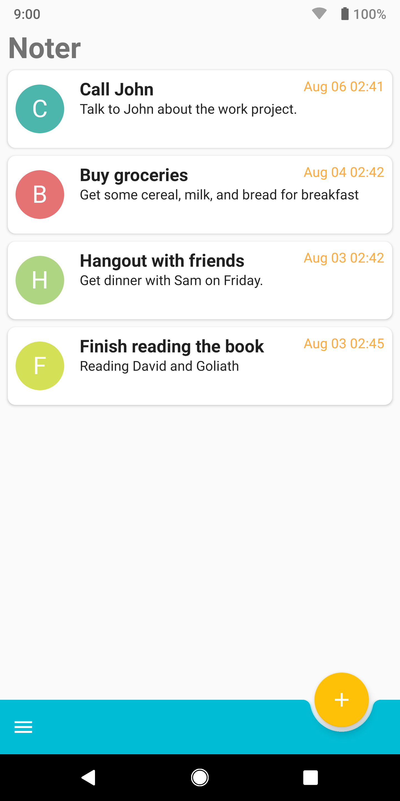
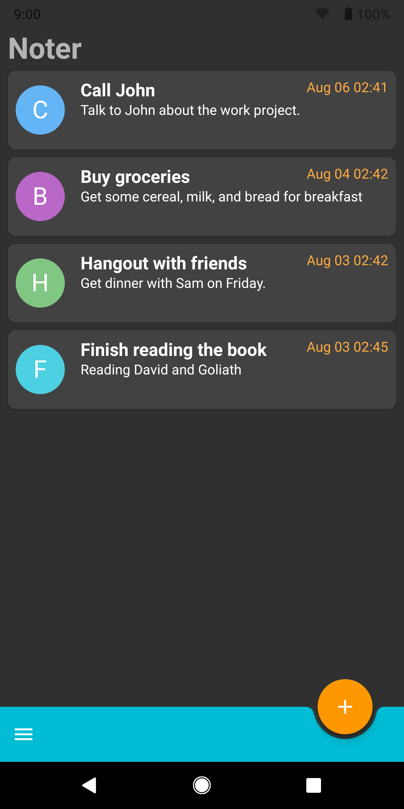
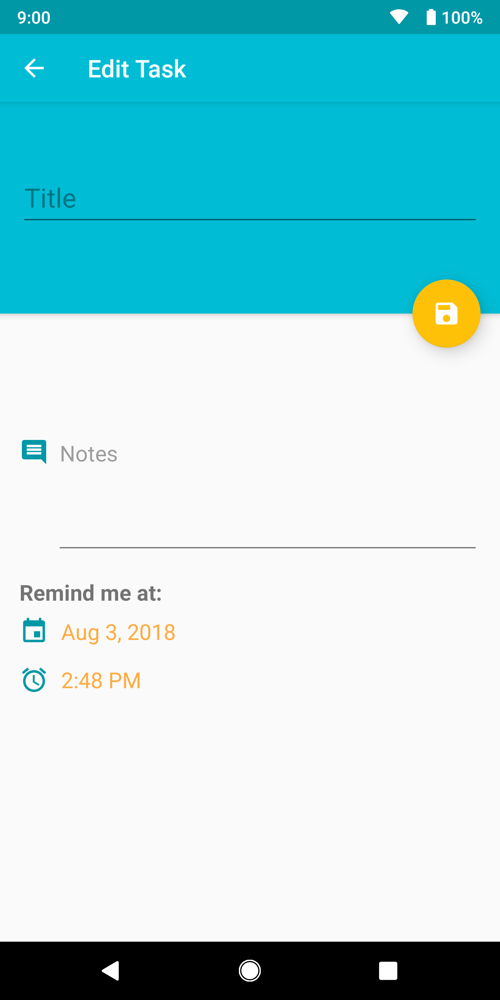
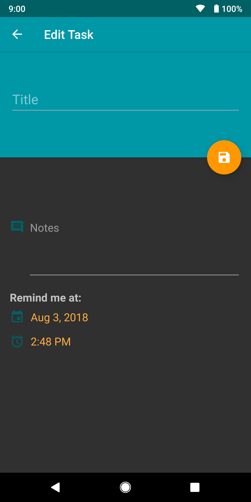
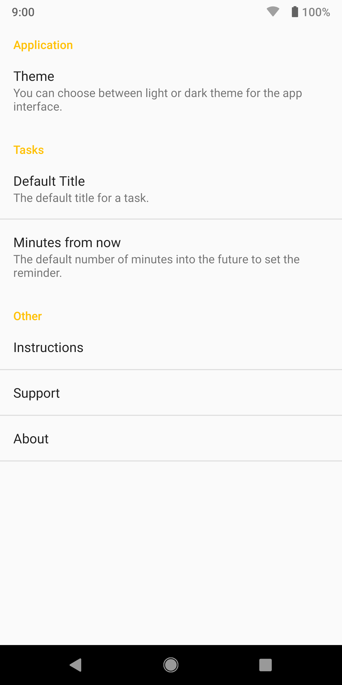

 
# Noter
Noter is a free, simple, private note and todo app. Everything is located in a central location on a single list and stored privately on your smartphone or tablet. It is also designed with the latest Material Design components and guidelines.

# Getting Started
--------------
To start developing in Android Studio, download the project as a zip file. Then simply un-zip and import the folder in Android Studio.

# Features
--------------
- Material Design 2.0
- No permissions needed
- Small and light-weight app
- Everything is stored locally on your device for best privacy
- Set reminder date and time for each tasks
- Personalize with light and dark themes 
- Completely free, ad-free and open source

# Screenshots
--------------
 
 
 
 
 

# Acknowledgements
--------------
* Android App Development for Dummies 3rd Edition by Michael Burton (Author)

# Imported Dependencies
--------------
* [TextDrawable](https://github.com/amulyakhare/TextDrawable)
* [AppIntro](https://github.com/apl-devs/AppIntro)
* [SwipeableRecyclerView](https://github.com/brnunes/SwipeableRecyclerView)
* [Android About Page](https://github.com/medyo/android-about-page)

# Copyright
--------------
Copyright 2018 Bowen Chin. All rights reserved. 

Licensed under the Apache License, Version 2.0 (the "License");
you may not use this file except in compliance with the License.
You may obtain a copy of the License at

   http://www.apache.org/licenses/LICENSE-2.0

Unless required by applicable law or agreed to in writing, software
distributed under the License is distributed on an "AS IS" BASIS,
WITHOUT WARRANTIES OR CONDITIONS OF ANY KIND, either express or implied.
See the License for the specific language governing permissions and
limitations under the License.
