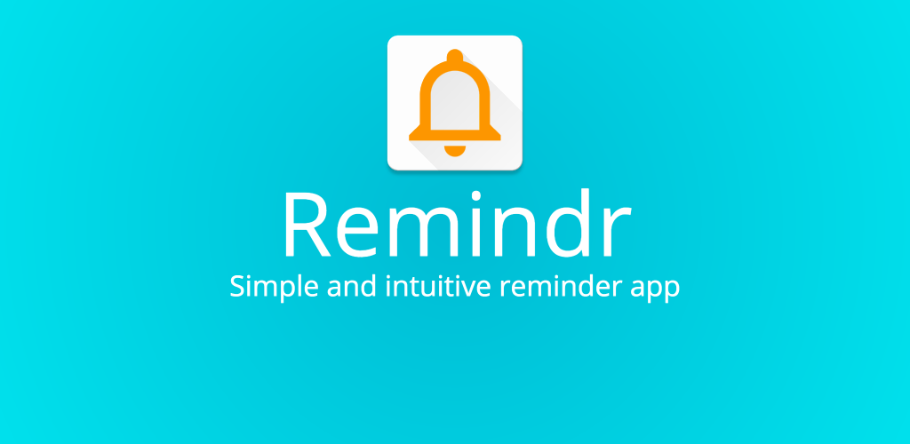
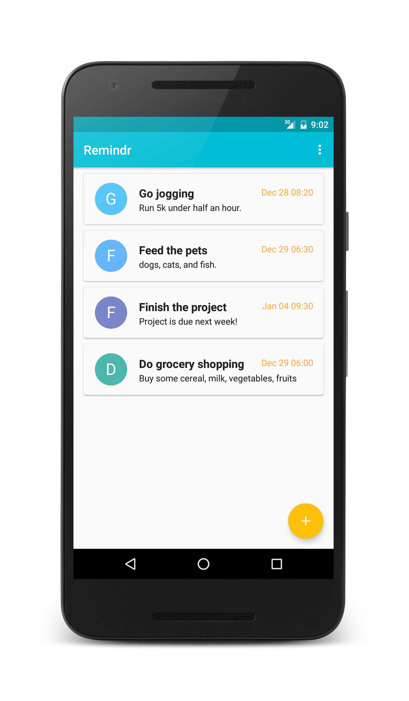
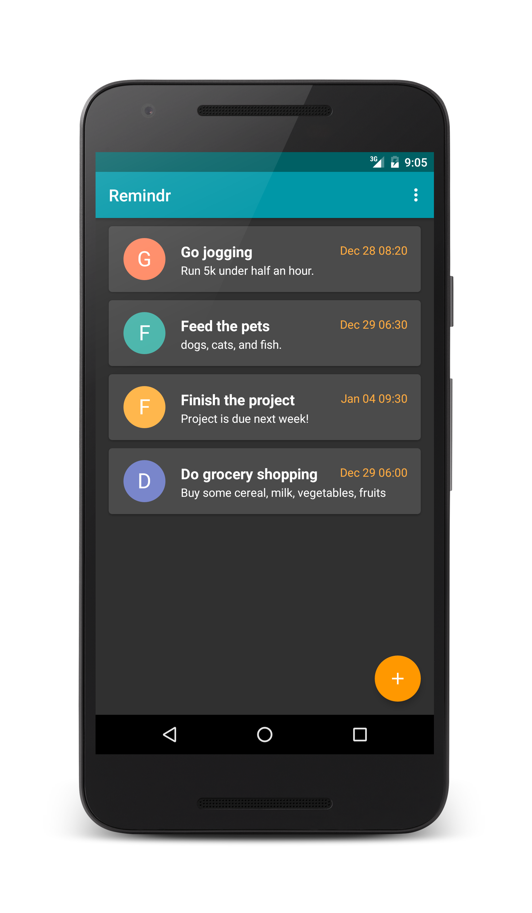
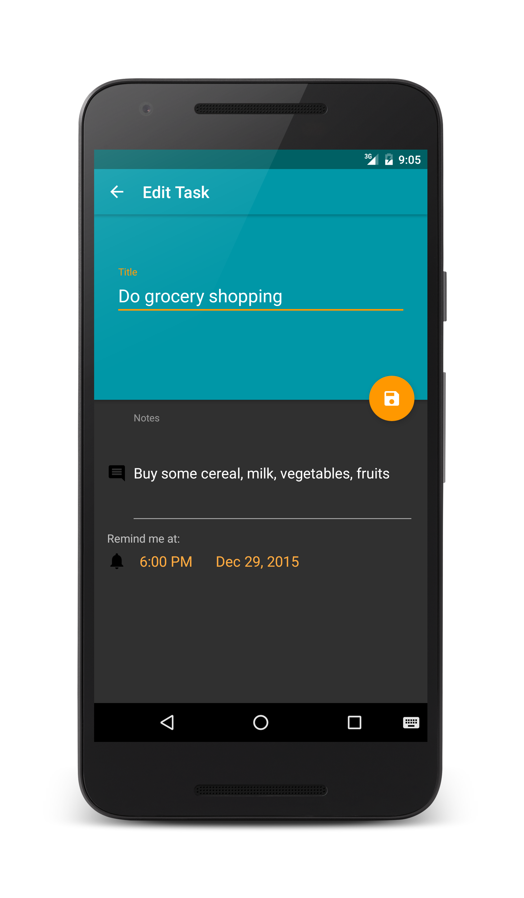

 
# Remindr
Remindr is a simple and intuitive reminder and to-do task manager application.

[Join the Google Play alpha-release channel!](https://play.google.com/apps/testing/com.bowenchin.android.taskr)

# Getting Started
--------------
To start developing in Android Studio, download the project as a zip file. Then simply un-zip the folder and "Import Project" in Android Studio by navigating and selecting the folder you should have created.

# Screenshots
--------------
 
 
 

#Acknowledgements
--------------
* Android App Development for Dummies 3rd Edition by Michael Burton (Author)

#Imported Dependencies
--------------
* [TextDrawable](https://github.com/amulyakhare/TextDrawable) by amulyakhare

#Copyright
--------------
Copyright 2016 Bowen Chin. All rights reserved. 

Licensed under the Apache License, Version 2.0 (the "License");
you may not use this file except in compliance with the License.
You may obtain a copy of the License at

   http://www.apache.org/licenses/LICENSE-2.0

Unless required by applicable law or agreed to in writing, software
distributed under the License is distributed on an "AS IS" BASIS,
WITHOUT WARRANTIES OR CONDITIONS OF ANY KIND, either express or implied.
See the License for the specific language governing permissions and
limitations under the License.
